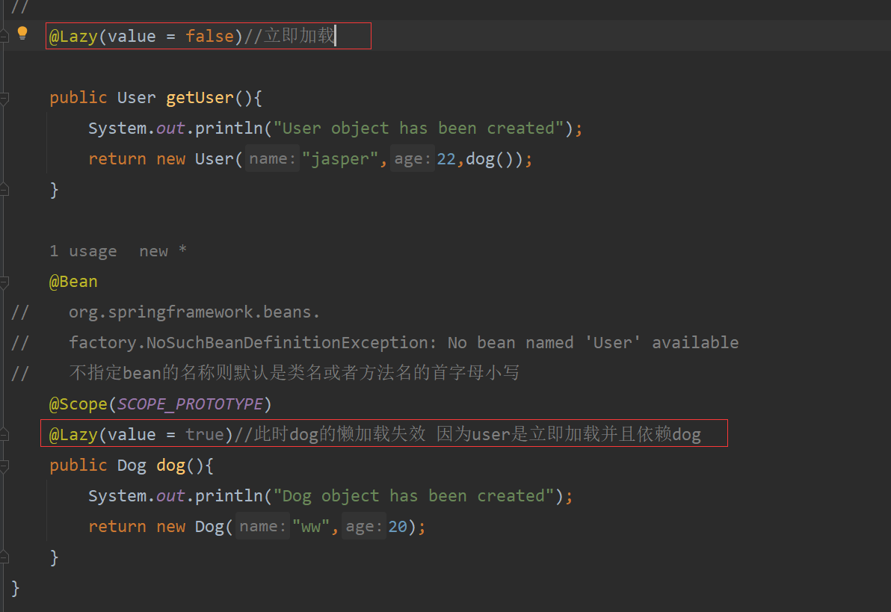
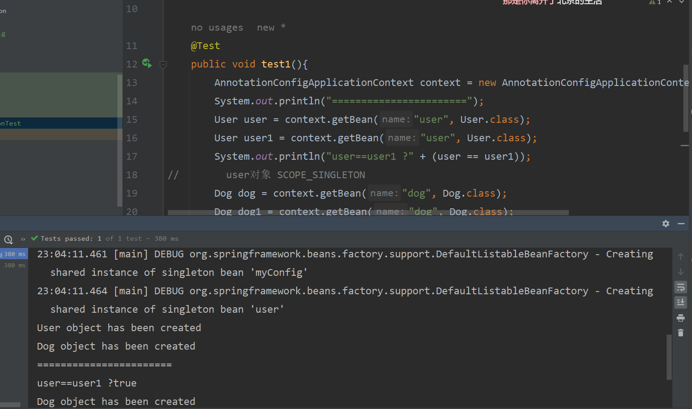
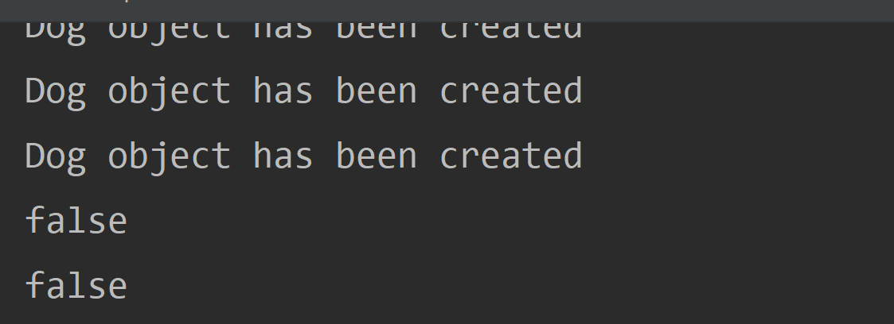
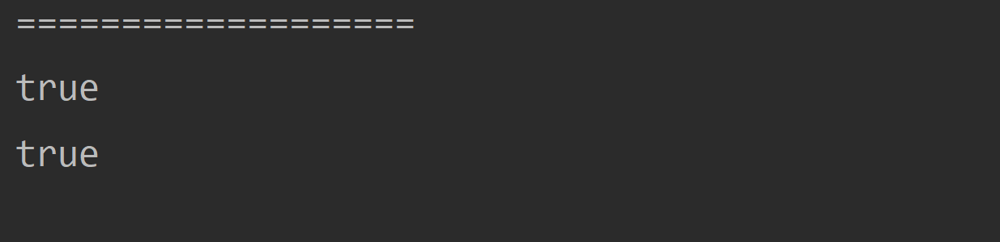

# basic
## @Lazy
spring默认会在应用上下文启动的时候创建所有单例bean
这样可以立即避免和检测所有的可能的错误，而不是在运行时




## @Configuration
### false
prxoyBeanMethod = false时 config.sout
com.spring.Annotation.configuration.ConfigProxyBeanMethod@2a54a73f
是一个lite的配置类 没有代理功能
```java
    @Test
public void test3(){
        AnnotationConfigApplicationContext context = new AnnotationConfigApplicationContext(ConfigProxyBeanMethod.class);
        System.out.println("===================");
        ConfigProxyBeanMethod config = context.getBean("configProxyBeanMethod", ConfigProxyBeanMethod.class);
        User user = config.user();
        User user1 = config.user();
        Dog dog = config.dog();
        Dog dog1 = config.dog();
        System.out.println(user == user1);
        System.out.println(dog == dog1);
        }
```
该模式下注入容器中的同一个组件无论
被取出多少次都是不同的bean实例


### true
proxyBeanMethod = true config.sout
com.spring.Annotation.configuration.ConfigProxyBeanMethod$$EnhancerBySpringCGLIB$$328c9cb5@4b29d1d2
是一个Full的配置类 使用cglib代理
从ioc容器中获取对象都是同一个
代理对象调用对象是会判断是否在容器中


- 当在你的同一个Configuration配置类中，注入到容器中的bean实例之间有依赖关系时，建议使用Full全模式
- 当在你的同一个Configuration配置类中，注入到容器中的bean实例之间没有依赖关系时，建议使用Lite轻量级模式，以提高springboot的启动速度和性能

